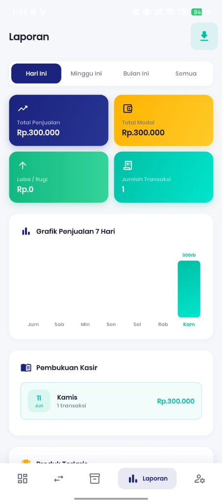

# Kasir Kilat

<div align="center">
  
  <h3>Aplikasi Point of Sales (POS) Berbasis Flutter dan Firebase</h3>
  <p>
    Aplikasi kasir digital untuk membantu UMKM dalam mengelola produk, transaksi, stok barang, dan laporan penjualan secara real-time.
  </p>
</div>

---

## 📌 Deskripsi Project

**Kasir Kilat** adalah aplikasi **Point of Sales (POS)** atau kasir digital yang dirancang untuk kebutuhan operasional UMKM. Aplikasi ini membantu pengguna dalam melakukan pencatatan transaksi, pengelolaan data produk, pemantauan stok, serta pembuatan laporan penjualan.

Project ini dikembangkan menggunakan **Flutter** sebagai framework utama dan **Firebase Cloud Firestore** sebagai database real-time. Aplikasi ini juga menerapkan state management menggunakan **GetX** agar pengelolaan data dan navigasi lebih terstruktur.

---

## 🎯 Tujuan Project

Tujuan dari pengembangan aplikasi ini adalah:

- Membantu UMKM melakukan pencatatan transaksi secara digital.
- Mempermudah pengelolaan produk dan stok barang.
- Menyediakan laporan penjualan yang dapat digunakan untuk evaluasi bisnis.
- Menerapkan konsep pengembangan aplikasi mobile menggunakan Flutter.
- Mengintegrasikan aplikasi mobile dengan database cloud menggunakan Firebase.

---

## ✨ Fitur Utama

### 1. Dashboard

Dashboard menampilkan ringkasan informasi penting dari aktivitas penjualan, seperti data transaksi, stok barang, dan performa penjualan.

### 2. Manajemen Produk

Fitur ini digunakan untuk mengelola data produk/barang, meliputi:

- Menambahkan produk baru.
- Mengubah data produk.
- Menghapus produk.
- Melihat daftar produk.
- Melakukan pencarian dan filter produk.
- Melihat stok produk.

### 3. Transaksi Penjualan

Fitur transaksi digunakan untuk mencatat proses penjualan barang. Pada fitur ini pengguna dapat:

- Memilih produk yang akan dibeli.
- Menambahkan produk ke keranjang.
- Menghitung total pembayaran.
- Memilih metode pembayaran.
- Menyimpan transaksi ke database.
- Mengurangi stok barang secara otomatis setelah transaksi berhasil.

### 4. Laporan Penjualan

Fitur laporan digunakan untuk melihat hasil penjualan berdasarkan periode tertentu. Laporan mencakup:

- Total penjualan.
- Total modal.
- Laba/rugi.
- Jumlah transaksi.
- Grafik penjualan.
- Produk terlaris.
- Export laporan dalam format CSV.

### 5. Manajemen User

Aplikasi memiliki role pengguna, yaitu:

- **Admin**: dapat mengakses fitur pengelolaan user dan data sensitif seperti modal serta laba/rugi.
- **Karyawan**: dapat mengakses fitur operasional kasir, tetapi tidak dapat mengelola user.

---

## 🖼️ Screenshot Aplikasi

> Screenshot berikut digunakan sebagai dokumentasi hasil run aplikasi.

<div align="center">
  
  &nbsp;&nbsp;&nbsp;
  
  &nbsp;&nbsp;&nbsp;
  
  &nbsp;&nbsp;&nbsp;
  
</div>

---

## 🛠️ Teknologi yang Digunakan

| Teknologi          | Keterangan                                                          |
| ------------------ | ------------------------------------------------------------------- |
| Flutter            | Framework utama untuk pengembangan aplikasi mobile                  |
| Dart               | Bahasa pemrograman yang digunakan pada Flutter                      |
| Firebase Core      | Konfigurasi utama Firebase                                          |
| Cloud Firestore    | Database real-time untuk menyimpan data user, barang, dan transaksi |
| Firebase Storage   | Penyimpanan file/gambar jika diperlukan                             |
| GetX               | State management dan navigasi                                       |
| Intl               | Format tanggal dan mata uang                                        |
| Mobile Scanner     | Scanner barcode/QR                                                  |
| Permission Handler | Mengelola izin akses perangkat                                      |
| Path Provider      | Mengakses direktori penyimpanan lokal                               |
| Lottie             | Animasi pada tampilan aplikasi                                      |

---

## 📂 Struktur Project

```text
lib/
├── auth/                 # Halaman login dan kelola user
├── barang/               # Halaman dan komponen manajemen produk
├── controller/           # Controller GetX untuk auth, barang, user, dan transaksi
├── dashboard/            # Halaman dashboard aplikasi
├── laporan/              # Halaman laporan penjualan dan export CSV
├── manage/               # Helper dan utilitas aplikasi
├── notification/         # Helper notifikasi aplikasi
├── theme/                # Konfigurasi warna dan tema aplikasi
├── transaksi/            # Halaman transaksi, keranjang, dan riwayat transaksi
└── main.dart             # Entry point aplikasi
```

---

## 🗄️ Struktur Database Firestore

Aplikasi menggunakan beberapa collection utama pada Cloud Firestore:

```text
users
barang
transaksi
```

### Collection `users`

Contoh field:

| Field     | Tipe Data | Keterangan                               |
| --------- | --------- | ---------------------------------------- |
| nama      | String    | Nama pengguna                            |
| username  | String    | Username untuk login                     |
| password  | String    | Password pengguna                        |
| role      | String    | Role pengguna, yaitu admin atau karyawan |
| aktif     | Boolean   | Status aktif akun                        |
| createdAt | Timestamp | Waktu pembuatan akun                     |

### Collection `barang`

Contoh field:

| Field  | Tipe Data | Keterangan          |
| ------ | --------- | ------------------- |
| bar    | String    | Kode/barcode barang |
| nama   | String    | Nama barang         |
| harga  | Number    | Harga jual barang   |
| modal  | Number    | Harga modal barang  |
| jumlah | Number    | Jumlah stok barang  |
| tgl    | Timestamp | Waktu data dibuat   |

### Collection `transaksi`

Contoh field:

| Field  | Tipe Data | Keterangan                |
| ------ | --------- | ------------------------- |
| data   | Array     | Daftar barang yang dibeli |
| bayar  | Number    | Total pembayaran          |
| metode | String    | Metode pembayaran         |
| tgl    | Timestamp | Waktu transaksi           |

---

## 🔐 Akun Demo

Aplikasi menyediakan contoh akun untuk kebutuhan pengujian.

| Role     | Username | Password |
| -------- | -------- | -------- |
| Admin    | admin01  | admin123 |
| Karyawan | kasir01  | kasir123 |

> Catatan: Akun demo digunakan untuk kebutuhan pengujian project. Untuk penggunaan production, sistem autentikasi sebaiknya menggunakan Firebase Authentication atau mekanisme hashing password yang lebih aman.

---

## 🚀 Cara Menjalankan Project

### 1. Clone Repository

```bash
git clone https://github.com/Frizr/KasirKilat.git
cd KasirKilat
```

### 2. Install Dependency

```bash
flutter pub get
```

### 3. Setup Firebase

Pastikan project Firebase sudah dibuat dan package name Android sesuai dengan konfigurasi aplikasi:

```text
com.tutu.cashier
```

Langkah setup Firebase:

1. Buka Firebase Console.
2. Buat atau pilih project Firebase.
3. Tambahkan aplikasi Android dengan package name `com.tutu.cashier`.
4. Download file `google-services.json`.
5. Letakkan file tersebut di folder:

```text
android/app/google-services.json
```

6. Aktifkan Cloud Firestore.
7. Buat collection utama: `users`, `barang`, dan `transaksi`.

### 4. Jalankan Aplikasi

```bash
flutter run
```

### 5. Build APK Debug

```bash
flutter build apk --debug
```

### 6. Build APK Release

```bash
flutter build apk --release
```

---

## ✅ Pengujian

Beberapa skenario pengujian yang dilakukan:

| No  | Skenario                  | Hasil yang Diharapkan                                |
| --- | ------------------------- | ---------------------------------------------------- |
| 1   | Login sebagai admin       | Admin berhasil masuk dan menu Kelola muncul          |
| 2   | Login sebagai karyawan    | Karyawan berhasil masuk dan menu Kelola tidak muncul |
| 3   | Tambah produk             | Produk berhasil tersimpan ke Firestore               |
| 4   | Edit produk               | Data produk berhasil diperbarui                      |
| 5   | Hapus produk              | Produk berhasil dihapus                              |
| 6   | Checkout stok cukup       | Transaksi berhasil dan stok berkurang                |
| 7   | Checkout stok tidak cukup | Transaksi gagal dan stok tidak minus                 |
| 8   | Spam tombol checkout      | Transaksi tidak tercatat ganda                       |
| 9   | Buka laporan              | Data laporan tampil tanpa crash                      |
| 10  | Export CSV                | File laporan berhasil dibuat                         |

---

## 📊 Status Project

Project sudah menyelesaikan fitur utama aplikasi POS, meliputi:

- Login user.
- Role admin dan karyawan.
- Dashboard.
- Manajemen produk.
- Transaksi penjualan.
- Pengurangan stok otomatis.
- Laporan penjualan.
- Export CSV.
- Integrasi Firebase Firestore.

---

## 👥 Kontribusi Anggota Kelompok

| Nama Anggota                       | Kontribusi                                                |
| ---------------------------------- | --------------------------------------------------------- |
| Ahmad Dzaki Zayyan Sugianto        | Mengembangkan halaman login dan autentikasi               |
| Ardy Ferdinand Christanto Mongdong | Mengembangkan fitur manajemen produk                      |
| Mohammad Afrizal Rizky Setyawan    | Mengembangkan fitur transaksi penjualan                   |
| Athallah Zaki Ramatiansyah         | Mengembangkan dashboard dan laporan dan integrasi backend |

> Silakan sesuaikan nama anggota dan kontribusi sesuai pembagian tugas kelompok.

---

## 📎 Link Repository

Repository GitHub:

```text
https://github.com/Frizr/KasirKilat
```

---

## 📝 Catatan

Project ini dibuat untuk memenuhi kebutuhan **Tugas Besar 2** pada mata kuliah pengembangan aplikasi berbasis Flutter. Aplikasi ini masih dapat dikembangkan lebih lanjut, terutama pada bagian keamanan autentikasi, optimasi performa, dan deployment production.

---

<div align="center">
  <b>Kasir Kilat</b><br>
  Aplikasi POS digital untuk operasional UMKM yang lebih cepat, praktis, dan terstruktur.
</div>
